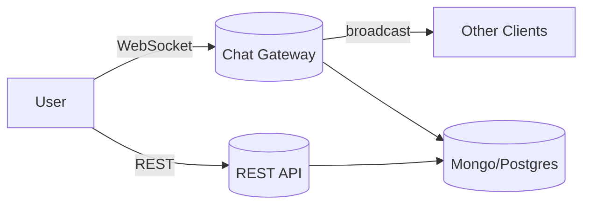

<h1 align="center">OUSSAMA TARIGHT</h1>

FULL-STACK DEVELOPER · L2 COMPUTER SCIENCE @ USTHB

	

## 💫 ABOUT

- I build modern web and mobile apps with Next.js, TypeScript, Express, MongoDB/PostgreSQL, Tailwind CSS, and React Native.
- I focus on clean architecture, responsive UX, and reliable delivery from prototype to production.
- I’m actively learning advanced TypeScript patterns and scalable cloud setups.

## 🌐 SOCIALS

## 🧰 TECH

                   

## 📌 HIGHLIGHTS

- Built real-time experiences (chat, live updates) with WebSocket-ready stacks.
- Delivered mobile-first UIs with strong accessibility and RTL/LTR support.
- Comfortable across data layers: schema design, auth, caching, deployment.

## 🧭 FLOW (MERMAID)

## 📊 GITHUB STATS

---

