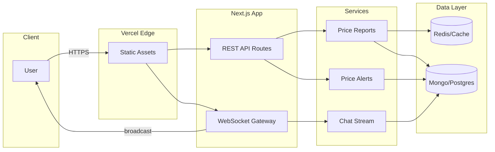
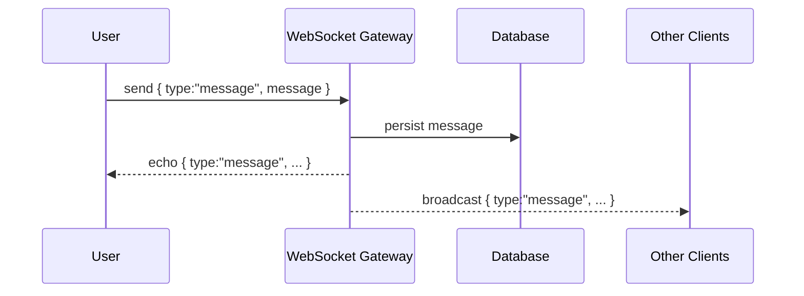

# ChoufPrice DZ Platform

<div align="center">

**🇩🇿 Live Price Monitoring Platform for Algeria**

[](https://nextjs.org/)
[](https://www.typescriptlang.org/)
[](https://tailwindcss.com/)
[](https://leafletjs.com/)

[Live Demo](https://chouf-price-dz-platform.vercel.app/) • [Report Bug](https://github.com/oussamatght/ChoufPrice-DZ-Platform/issues) • [Request Feature](https://github.com/oussamatght/ChoufPrice-DZ-Platform/issues)

</div>

---

## 📋 Table of Contents

- [About](#-about)
- [Features](#-features)
- [Tech Stack](#-tech-stack)
- [Getting Started](#-getting-started)
- [Project Structure](#-project-structure)
- [Key Components](#-key-components)
- [Performance](#-performance)
- [Contributing](#-contributing)
- [License](#-license)
- [Architecture](#-architecture)
- [Presentation](#-presentation)
- [Assessor Guide](#-assessor-guide)

---

## 🌟 About

**ChoufPrice DZ** is a community-driven platform that empowers Algerians to track and share real-time prices of products across all 58 wilayas. With over **54,900 price reports** visualized on an interactive map, users can make informed purchasing decisions and report price changes in their local areas.

### Why ChoufPrice DZ?

- 🗺️ **Interactive Map**: Visualize price data across Algeria with clustering technology
- 📊 **Real-Time Updates**: Community-contributed price reports updated continuously
- 🔍 **Smart Filtering**: Filter by categories (food, electronics, fuel, etc.)
- 💬 **Community Chat**: Discuss price trends with other users
- 🚨 **Price Alerts**: Get notified of abnormal price changes
- 📱 **Fully Responsive**: Works seamlessly on mobile, tablet, and desktop

---

## ✨ Features

### Core Features

- ✅ **Live Price Map** - Interactive Leaflet map with 54,900+ data points
- ✅ **Category Filtering** - 10 product categories (food, beverages, electronics, etc.)
- ✅ **Price Alerts** - Detect and display abnormal price fluctuations
- ✅ **Community Chat** - Real-time communication between users
- ✅ **User Authentication** - JWT-based auth with anonymous login option
- ✅ **Voting System** - Upvote/downvote price reports for accuracy
- ✅ **Search Functionality** - Find products or cities instantly
- ✅ **Statistics Dashboard** - Overview of price trends and totals

### Technical Features

- ⚡ **Optimized Performance** - Batch rendering for 54K+ markers
- 🎨 **Modern UI** - Built with Radix UI and shadcn/ui components
- 🌙 **Dark Mode Ready** - Theme system with CSS variables
- 📐 **Responsive Design** - Mobile-first approach with Tailwind CSS
- 🗃️ **Type Safety** - Full TypeScript implementation
- 🔧 **Marker Clustering** - Leaflet.markercluster for smooth map interaction
- 🎯 **Spiderfy Effect** - Beautiful marker expansion on click

---

## 🛠️ Tech Stack

### Frontend

- **Framework**: [Next.js 16](https://nextjs.org/) (App Router)
- **Language**: [TypeScript 5](https://www.typescriptlang.org/)
- **Styling**: [Tailwind CSS 4.1](https://tailwindcss.com/)
- **UI Components**: [Radix UI](https://www.radix-ui.com/) + [shadcn/ui](https://ui.shadcn.com/)
- **Map Library**: [Leaflet 1.9.4](https://leafletjs.com/) + [leaflet.markercluster](https://github.com/Leaflet/Leaflet.markercluster)

### Additional Libraries

- **Date Handling**: [date-fns 4.1](https://date-fns.org/)
- **Form Management**: [react-hook-form](https://react-hook-form.com/) + [Zod](https://zod.dev/)
- **Toast Notifications**: [Sonner](https://sonner.emilkowal.ski/)
- **Analytics**: [Vercel Analytics](https://vercel.com/analytics)
- **Icons**: [Lucide React](https://lucide.dev/)

### Data

- **58 Algerian Cities** - With communes and coordinates
- **300+ Products** - Across 10 categories
- **54,900+ Price Reports** - Generated with realistic variations

---

## 🚀 Getting Started

### Prerequisites

```bash
Node.js 18+ and npm/pnpm
```

### Installation

1. **Clone the repository**

   ```bash
   git clone https://github.com/oussamatght/ChoufPrice-DZ-Platform.git
   cd ChoufPrice-DZ-Platform
   ```

2. **Install dependencies**

   ```bash
   npm install
   # or
   pnpm install
   ```

3. **Run development server**

   ```bash
   npm run dev
   ```

4. **Open in browser**
   ```
   http://localhost:3000
   ```

### Build for Production

```bash
npm run build
npm start
```

---

## 📁 Project Structure

```
ChoufPrice-DZ-Platform/
├── app/                      # Next.js App Router
│   ├── layout.tsx           # Root layout with providers
│   ├── page.tsx             # Dashboard page
│   ├── login/               # Login page
│   ├── register/            # Registration page
│   └── about/               # About page
├── components/              # React components
│   ├── ui/                  # shadcn/ui components
│   ├── price-map.tsx        # Interactive Leaflet map
│   ├── price-list.tsx       # Price reports list
│   ├── price-alerts.tsx     # Abnormal price alerts
│   ├── community-chat.tsx   # Chat interface
│   ├── add-price-form.tsx   # Submit price form
│   └── ...
├── context/                 # React Context providers
│   └── auth-context.tsx     # Authentication logic
├── data/                    # Static data
│   ├── algeria-cities.ts    # 58 cities with coordinates
│   └── products.ts          # 300+ products, 54K+ reports
├── types/                   # TypeScript definitions
├── lib/                     # Utility functions
└── public/                  # Static assets
```

---

## 🔑 Key Components

### PriceMap Component

- **Dynamic Import**: SSR disabled for Leaflet compatibility
- **Marker Clustering**: Groups nearby markers for performance
- **Batch Rendering**: Processes 10,000 markers at a time
- **Custom Clusters**: Yellow/gold gradient with dynamic sizing
- **Spiderfy Effect**: Expands clusters into connected markers

### Authentication System

- JWT token-based authentication
- Anonymous login option
- LocalStorage persistence
- Protected routes with redirects

### Data Generation

- Realistic price variations (70-130% of average)
- Random timestamps (last 30 days)
- Position randomization within cities
- Abnormal price detection (>25% deviation)

---

## ⚡ Performance

### Optimizations Implemented

- ✅ **Dynamic Imports** - Map loads client-side only
- ✅ **useMemo Hooks** - Cached filtered data
- ✅ **Batch Processing** - Markers added in chunks
- ✅ **Chunked Loading** - Leaflet.markercluster settings
- ✅ **Remove Outside Bounds** - Only render visible markers
- ✅ **Debounced Search** - Reduce re-renders
- ✅ **Skeleton Loaders** - Better perceived performance

### Metrics

- **Initial Load**: ~2-3 seconds
- **Map Render**: 54,900 markers with clustering
- **Zoom Performance**: Smooth transitions
- **Mobile Optimized**: Touch-friendly controls

---

## 🧭 Architecture



---

## 🎥 Presentation

- Demo video: https://youtu.be/your-demo-link
- Slide deck: https://slides.com/your-deck
- Live demo: https://chouf-price-dz-platform.vercel.app/

Suggested demo flow:
- 1) Login or anonymous join, language switch (FR/AR/EN, RTL UI)
- 2) Explore map: clustering, spiderfy, filtering by category
- 3) Submit a price report and see it appear on the map
- 4) Vote on a report and show stats updating
- 5) Open chat, send a message (optimistic), delete your message (broadcast)
- 6) Trigger abnormal price alert and show alert banner

Sequence (chat real-time):



---


If evaluating locally:

```bash
# Frontend
npm install
npm run dev

# Backend (in /backend)
npm install
cp .env.example .env
npm run dev
```

## 🤝 Contributing

Contributions are welcome! Please follow these steps:

1. Fork the repository
2. Create a feature branch (`git checkout -b feature/AmazingFeature`)
3. Commit your changes (`git commit -m 'Add AmazingFeature'`)
4. Push to the branch (`git push origin feature/AmazingFeature`)
5. Open a Pull Request

---

## 📝 License

This project is licensed under the MIT License.

---

## 👥 Authors

- **Oussama** - [GitHub](https://github.com/oussamatght)

---

## 🙏 Acknowledgments

- [OpenStreetMap](https://www.openstreetmap.org/) - Map tiles
- [Vercel](https://vercel.com/) - Hosting and deployment
- Algerian developer community

---

<div align="center">

**⭐ Star this repo if you find it helpful!**

Made with ❤️ for Algeria 🇩🇿

</div>
